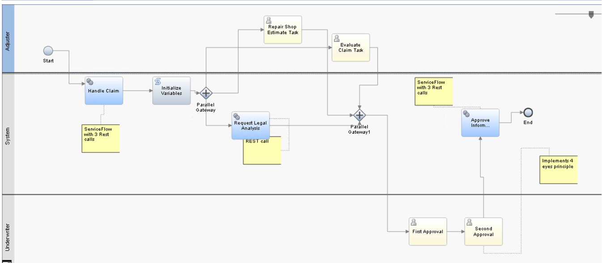

This chapter provides guidance for how to design and deploy a high-performing and scalable Workflow solution:
* Deployment and maintenance guidelines
* Design guidelines

# Deployment and maintenance guidelines

## Use the right CP4BA deployment size
When installing Workflow patterns within the Cloud Pak for Business Automation you can choose between Small, Medium or Large deployment sizes for Workflow, Zen and Common Services. Generally it is recommended to use the same deployment sizes for CP4BA, Zen and Common Services.

❗IMPORTANT: These are **T-Shirt** sizings and should give you a starting point for your final sizing. 

Depending on your workload type and your hardware you can expect the following load that can be handled by the deployment size. 

### Authoring
* Small: 10 concurrent developer
* Medium: 20 concurrent developer
* Large: 50 concurrent developer

### Runtime
#### Small
* 25 concurrent users working on Human Centric Processes and Cases and ~5K Human Centric Processes processes per 8-hour day, or
* 500K Straight Thru Processes processes per 8-hour day without human interaction, or
* 1.25 million Straight Thru Service Flows per 8-hour day without human interaction

#### Medium
* 125 concurrent users working on Human Centric Processes and Cases and ~25K Human Centric Processes processes per 8-hour day, or
* 1 million Straight Thru Processes processes per 8-hour day without human interaction, or
* 3.5 million Straight Thru Service Flows per 8-hour day without human interaction

#### Large
* 625 concurrent users working on Human Centric Processes and Cases and ~125K Human Centric Processes processes per 8-hour day, or
* 2 million Straight Thru Processes processes per 8-hour day without human interaction, or
* 7 million Straight Thru Service Flows per 8-hour day without human interaction

### Database considerations for workflow database
#### Small Workload:
* Recommended at least 2 CPUs for the database server (or more, if specified by the DB vendor).
* For database server memory sizing, consult each DB vendor’s recommendation. In general, the  database server must be provisioned with enough physical memory to accommodate buffer pools and other in-memory cache to support efficient execution of typical database queries.
* 100GB storage - may vary on cleanup strategy.

#### Medium Workload:
* Recommended at least 4 CPUs for the database server
* For database server memory sizing, consult each DB vendor’s recommendation. In general, the database server must be provisioned with enough physical memory to accommodate buffer pools and other in-memory cache to support efficient execution of typical database queries.
* 100GB storage - may vary on cleanup strategy.

#### Large Workload:
* Recommended at least 8 CPUs for the database server
* For database server memory sizing, consult each DB vendor’s recommendation. In general, the database server must be provisioned with enough physical memory to accommodate buffer pools and other in-memory cache to support efficient execution of typical database queries.
* 100GB storage - may vary on cleanup strategy.

### Description of runtime benchmarks
#### Human Centric workflow representing an insurance claim

* 4 outbound REST invocations 
* 5 Human Tasks
* 1 parallel activities branch
* Users concurrently search active process instances for a list of tasks that they can perform. A work item is assigned and then completed by the user.
* Users “think” 20s between the search, assign, and complete activities.

#### Straight Thru stateful Process representing a travel booking process
* No human tasks
* The process invokes a service flow with 5 outbound rest services

#### Straight Thru stateless Flow representing a travel booking process
* No human tasks
* Service flow with 5 outbound rest services

## Use the most current product release, with the most current fix pack. 
IBM improves the performance, scalability, serviceability, and quality of the Workflow product line with every release and fix pack. With the most current level, you can avoid encountering issues that were already resolved by IBM.

## Use high-performance disk subsystems
In virtually any realistic topology, you must have a server-class disk subsystem on the tiers that host the Workflow data stores to achieve acceptable performance. This guidance applies to all databases and preferable the container hosts, too. We cannot overstate this point. In many cases, performance is improved by several factors by using appropriate disk subsystems.

## Use fast, high-bandwidth network connections. 
There is significant network activity for many Workflow activities, so minimizing network latency and ensuring sufficient bandwidth is essential between the following items:
* Workflow UIs (browser) and Workflow containers
* Workflow containers and its databases: We recommend to have a network latency below 1ms for high scale deployments.

## Maintain and purge Workflow data stores
To improve overall system performance, it can be important to purge data from the Workflow databases. A purging strategy should be considered from a performance point of view. 

### Workflow authoring
Workflow Authoring holds snapshots of Process Applications (PAs) and Toolkits as they are developed. In addition to every named snapshot you create, every time a save operation is done, an unnamed snapshot is created. As a result, a significant number of unnamed snapshots can accumulate over time, which can impact the performance of many operations. To remove named and unnamed snapshots from the system use the command: 
<https://www.ibm.com/docs/en/baw/25.x?topic=data-deleting-snapshots>

### Workflow runtime
Workflow runtime holds named snapshots of process applications that have been deployed to it. To remove named snapshots from the Process Server use the command: <https://www.ibm.com/docs/en/baw/25.x?topic=data-deleting-snapshots>
If completed process and task instances are not removed, they accumulate over time, which typically impact overall system performance, especially for task list queries like saved searches. To remove completed instances from use the command: <https://www.ibm.com/docs/en/baw/25.x?topic=data-deleting-process-instances>

## Set an appropriate Java heap size to deliver optimal throughput and response time. 
Memory usage data that is obtained through the JVM’s verbose garbage collection option (verbosegc) helps determine the optimal settings. Further information is available at <https://community.ibm.com/community/user/automation/blogs/florian-leybold1/2020/12/17/spot-garbage-collection-overhead-in-baw-on-contain>

## Use Search Optimization for searchable business variables
In non-federated Business Automation Workflow environments, you can optimize saved searches and control search results by using acceleration tools or setting configuration properties.
<https://community.ibm.com/community/user/automation/blogs/stephan-volz/2023/03/31/business-automation-workflow-saved-searches>

## Tune your database for optimal performance
Correct tuning and deployment choices for databases can greatly increase overall system throughput. For more details, see [Database configuration, tuning, and best practices](database.md)

## Tune the bpd-queue-capacity and max-thread-pool-size parameters to achieve optimal throughput and scaling
To optimize throughput and scaling, start with a bpd-queue-capacity of 10 per physical processor core (for example, 40 for a 4-processor core configuration), with a maximum value of 80: <https://www.ibm.com/docs/en/baw/25.x?topic=manager-event-configuration-settings>

## Disable tracing and logging
Tracing and logging are important when debugging, but the resources to do so severely affects performance. 

# Design guidelines

## Choose the appropriate granularity for a process
A business process and its individual steps should have business significance and not try to mimic programming-level granularity. Use programming techniques such as plain old Java objects (POJOs) or Java snippets for logic without business significance.

## For Straight Through Processing applications consider Service Flows instead of BPDs
Service Flows run stateless and have minimal dependencies to the workflow database during runtime. Performance is generally better compared to BPDs. 

## Use events judiciously
The purpose of event emission is business activity monitoring. Because event emission uses a persistent mechanism, it can consume significant processor resources. Use Common Base Events for events that have business relevance only. Do not confuse business activity monitoring and IT monitoring. 
The following principles generally apply for most customers:
* Customers are concerned about the state of their business and their processes. Therefore, events that signify changes in state are important. For long-running and human activities, this change in state is fairly common. Use events to track when long-running activities complete, such as when tasks change state.
* For short-running flows that complete within seconds, it is sufficient to know that a flow completes, perhaps with the associated data. Distinguishing events within a microflow like process or Service Flow that are only milliseconds or seconds apart usually does not make sense. Therefore, two events (start and end) are sufficient for a straight through process.

## Manage variable usage and persistence of Execution Context
Variables are persisted to the database when execution contexts are saved, which can happen fairly frequently by default. These persistence operations are expensive. Minimize the persistence cost in the following ways:
* disable "Save Execution Context"
* Minimize the number of variables used.
* Minimize the size of each variable.
* Set variables, such as DB result sets, to null when they are no longer needed.
* Minimize the number and size of variables that are passed to each task.

## Develop efficient coaches
This topic is discussed in detail in the IBM Redbooks publication Leveraging the IBM BPM Coach Framework in your organization, SG24-8210, available at the following location: <http://www.redbooks.ibm.com/redbooks.nsf/RedpieceAbstracts/sg248210.htm>

Following are key points extracted from this book:
* Use a modern browser. This is essential to achieve optimal response times. JavaScript processing and rendering are done within the browser; 
* Minimize the number of network requests to the server by combining resources such as JavaScript and images into single files, and using coarse grained APIs to combine multiple server actions into one request.
* Execute long running requests asynchronously to provide optimal user response time.
* Maximize browser concurrency (for example, using multiple channels effectively) by loading css files before JavaScript files to resolve dependencies, and loading both css and JavaScript files directly from html files.
* Minimize the number and size of business objects bound to a coach.
* Minimize the number of boundary events, since these result in network
requests to the server and database to persist state.

For tuning and troubleshooting refer to <https://www.ibm.com/support/pages/client-side-human-service-performance-troubleshooting>

## Large business objects
One issue that is frequently encountered by field personnel is identifying the largest object size that the Workflow server, corresponding document management functions can effectively and efficiently process. A number of factors affect large business object processing.
The JVM is the single most important factor affecting large business object processing. 
In general, objects that are 5 MB or larger might be considered “large” and require special attention. Objects of 100 MB or larger are “very large” and generally require significant tuning to be processed successfully.
BOs, when represented as Java objects, are much larger in size than when represented in wire format. For example, a BO that uses 10 MB on an input Java Message Service (JMS) message queue might result in allocations of up to 90 MB on the Java heap. This condition results from many allocations of large and small Java objects occurring as BO flows through the system.

## Large object design patterns
### Batched inputs: Sending large objects as multiple small objects
If a large object must be processed, the solutions engineer must find a way to limit the number of allocated large Java objects. The primary technique for limiting the number of objects involves decomposing large business objects into smaller objects and submitting them individually.
### Claim check pattern:
Only a small portion of an input message is used
When the input BO is too large to be carried around in a system and that process or mediation needs only a few attributes, you can use a pattern known as the claim check pattern. Using the claim check pattern, as applied to a BO, involves the following steps:
1. Detach the data payload from the message.
2. Extract the required attributes into a smaller control BO.
3. Persist the larger data payload to a data store and store the “claim check” as a reference in the control BO.
4. Process the smaller control BO, which has a smaller memory footprint.
5. When the solution needs the whole large payload again, check out the large payload from the data store using the key.
6. Delete the large payload from the data store.
7. Merge the attributes in the control BO with the large payload, taking into account the changed attributes in the control BO.
The claim check pattern requires custom code and snippets in the solution. A less developer-intensive variant is to use custom data bindings to generate the control BO. This approach is limited to certain export and import bindings. The full payload still must be allocated in the JVM.

